<!-- Generated by GitHub Profile Agent Console. Edit profile.config.json, then run npm run generate. -->

  <picture>
    <source media="(max-width: 760px) and (prefers-color-scheme: dark)" srcset="./assets/hero/agent-console-3547acb2-mobile-dark.svg">
    <source media="(max-width: 760px)" srcset="./assets/hero/agent-console-3547acb2-mobile-light.svg">
    <source media="(prefers-color-scheme: dark)" srcset="./assets/hero/agent-console-3547acb2-dark.svg">
    <source media="(prefers-color-scheme: light)" srcset="./assets/hero/agent-console-3547acb2-light.svg">
    
  </picture>

  
  

## About Me

Senior Software Engineer with 15+ years building enterprise web, mobile, and cloud-native applications. I specialize in Golang backends, clean architecture, and distributed systems that handle real transaction volume.

I lead engineering teams through sprint planning, code review, and deployment management, turning business requirements into reliable, well-tested production systems.

## Current Focus

| Area | What I am exploring |
| --- | --- |
| **Backend Engineering** | Golang and PHP backends with REST APIs, clean architecture, and microservices for enterprise-scale systems. |
| **Fullstack Development** | End-to-end application delivery with Next.js, React, React Native, and Laravel across web and mobile. |
| **Cloud & DevOps** | Containerized deployments with Docker, Kubernetes, AWS, and CI/CD pipelines for reliable releases. |
| **Team Leadership** | Sprint planning, code review, mentoring, and deployment management for engineering teams. |

## Featured Work

| Project | Focus | Why it matters |
| --- | --- | --- |
| [**ocr**](https://github.com/irawan19/ocr) | Golang OCR service | An OCR system built in Go that processes and extracts text from images, demonstrating practical Golang backend design and image processing pipelines. |
| [**jude-engine**](https://github.com/irawan19/jude-engine) | Real-time WebSocket backend | A socket backend built on WebSocket for real-time multiplayer games, showcasing low-latency connection handling and event-driven architecture in TypeScript. |
| [**pos**](https://github.com/irawan19/pos) | Point of Sales system | A full-featured Point of Sales application built with PHP, covering transactions, inventory, and reporting for retail operations. |
| [**cafe**](https://github.com/irawan19/cafe) | Cafe management platform | A Laravel-based cafe management system with Blade templates, handling orders, menus, and operational workflows for food and beverage businesses. |
| [**perpustakaan**](https://github.com/irawan19/perpustakaan) | Library management system | A TypeScript-based library management application for cataloging, circulation, and member management, demonstrating modern frontend practices. |

## Research Direction

My focus is designing backend systems that remain reliable under load: clean service boundaries, observable pipelines, and deployment workflows that teams can trust in production.

## Tech Stack

`Golang` · `Gin` · `PHP` · `Laravel` · `Next.js` · `React` · `React Native` · `PostgreSQL` · `MySQL` · `MongoDB` · `Docker` · `Kubernetes` · `AWS` · `Nginx` · `REST API` · `Microservices` · `Git` · `CI/CD`

## Recent Activity

<!-- AUTO:ACTIVITY:START -->
_Recent public activity will appear here after the workflow runs._
<!-- AUTO:ACTIVITY:END -->

---

  Building reliable backend systems that scale with the business.

