<!-- Generated by GitHub Profile Agent Console. Edit profile.config.json, then run npm run generate. -->

  <picture>
    <source media="(max-width: 760px) and (prefers-color-scheme: dark)" srcset="./assets/hero/agent-console-7114c0ec-mobile-dark.svg">
    <source media="(max-width: 760px)" srcset="./assets/hero/agent-console-7114c0ec-mobile-light.svg">
    <source media="(prefers-color-scheme: dark)" srcset="./assets/hero/agent-console-7114c0ec-dark.svg">
    <source media="(prefers-color-scheme: light)" srcset="./assets/hero/agent-console-7114c0ec-light.svg">
    
  </picture>

  
  

## About Me

Adaptable software engineer with 15+ years of experience and a diverse background in IT and data analytics, now specializing in cloud-native application development. Skilled in Go, PHP, JavaScript, Docker, AWS, and Kubernetes.

I design and maintain end-to-end web applications with Golang backends, Next.js frontends, and CI/CD pipelines, while also leading engineering teams through sprint planning, code review, and deployment management.

## Current Focus

| Area | What I am exploring |
| --- | --- |
| **Backend Engineering** | Golang and PHP backends with REST APIs, clean architecture, and microservices for enterprise-scale systems. |
| **Fullstack Development** | End-to-end application delivery with Next.js, React, React Native, and Laravel across web and mobile. |
| **Cloud & DevOps** | Containerized deployments with Docker, Kubernetes, AWS, and CI/CD pipelines for reliable releases. |
| **Team Leadership** | Sprint planning, code review, mentoring, and deployment management for engineering teams. |

## Featured Work

| Project | Focus | Why it matters |
| --- | --- | --- |
| [**HOSPIRE**](https://github.com/irawan19/irawan19) | Hospitality LMS platform | Enterprise Hospitality LMS built with Laravel 12, Vue 3, and Tailwind CSS. Combines program management, assessments, certifications, job placements, and payments with multi-language support and Docker deployment. |
| [**ICP**](https://github.com/irawan19/irawan19) | Enterprise collaboration platform | Unified collaboration platform with real-time chat, voice/video calls, task management, file drive, calendar, and document collaboration. Built with Go REST API, WebSocket, Next.js, and React Native. |
| [**Indotani POS**](https://github.com/irawan19/irawan19) | AI-powered POS & BI platform | AI-powered POS platform for retail and agricultural businesses with multi-branch management, inventory monitoring, and financial dashboards. Built with Golang (Gin), Next.js, PostgreSQL, and Redis. |
| [**Asset Recovery**](https://github.com/irawan19/irawan19) | Asset management system | Integrated asset management system with registration, distribution maps, maintenance tracking, valuation, QR code scanning, and RBAC. Built with Next.js, Golang (Gin), PostgreSQL, and Docker. |
| [**Smart Kantin**](https://github.com/irawan19/irawan19) | Canteen ordering platform | Multi-platform canteen management app for Telkom dormitories. Golang API, Laravel web, React Native mobile, PostgreSQL, Midtrans payments, Firebase notifications, and Alibaba Cloud ECS deployment. [Live](http://smartkantin.com/) |
| [**AdhyaksaPedia**](https://github.com/irawan19/irawan19) | Legal information platform | Public legal information platform with news, polls, events, Q&A, community complaints, helpdesk, GIS mapping, and reporting. Built for the Attorney General's office with mobile support and scalable architecture. |

## Research Direction

My focus is designing cloud-native backend systems that remain reliable under load: clean service boundaries, observable pipelines, and deployment workflows that teams can trust in production.

## Tech Stack

`Golang` · `Gin` · `PHP` · `Laravel` · `Next.js` · `React` · `React Native` · `Vue 3` · `TypeScript` · `JavaScript` · `PostgreSQL` · `MySQL` · `MongoDB` · `Redis` · `Docker` · `Kubernetes` · `AWS` · `CI/CD`

## Recent Activity

<!-- AUTO:ACTIVITY:START -->
_Recent public activity will appear here after the workflow runs._
<!-- AUTO:ACTIVITY:END -->

---

  Leveraging technology to solve complex problems and drive organizational growth.

